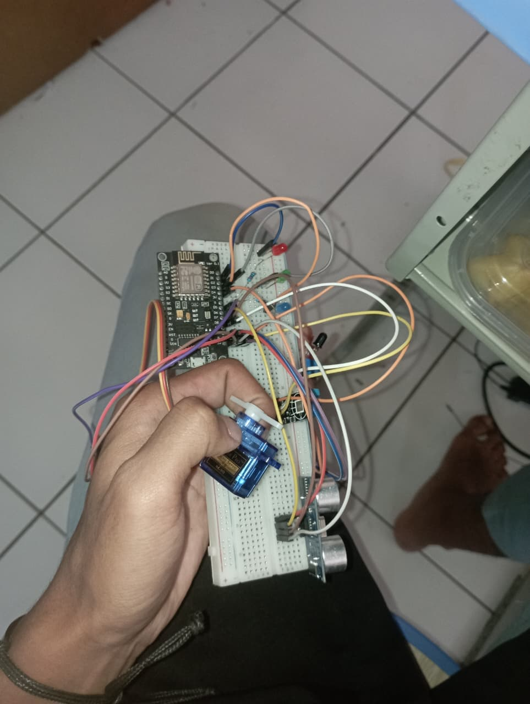
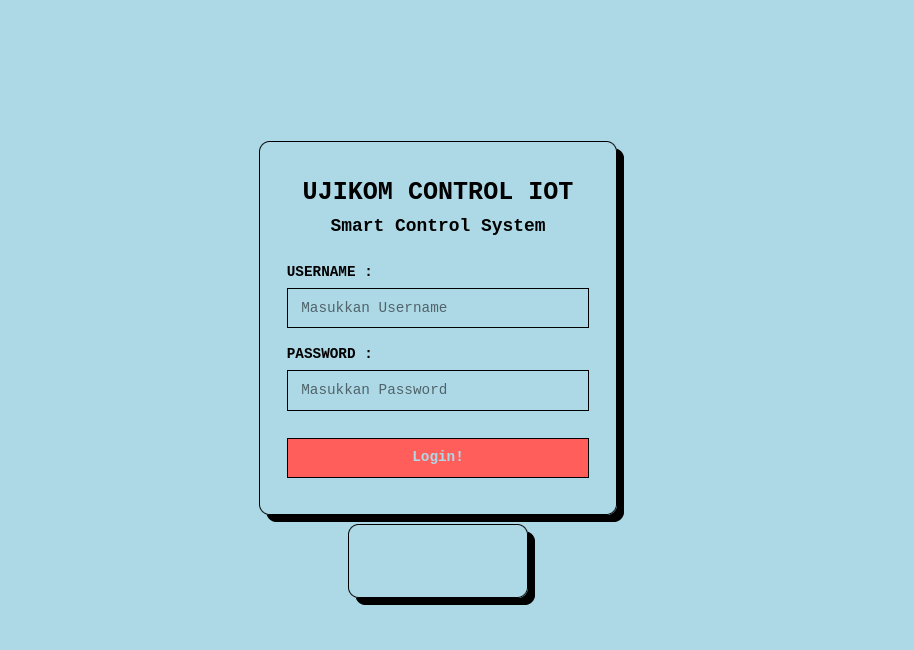
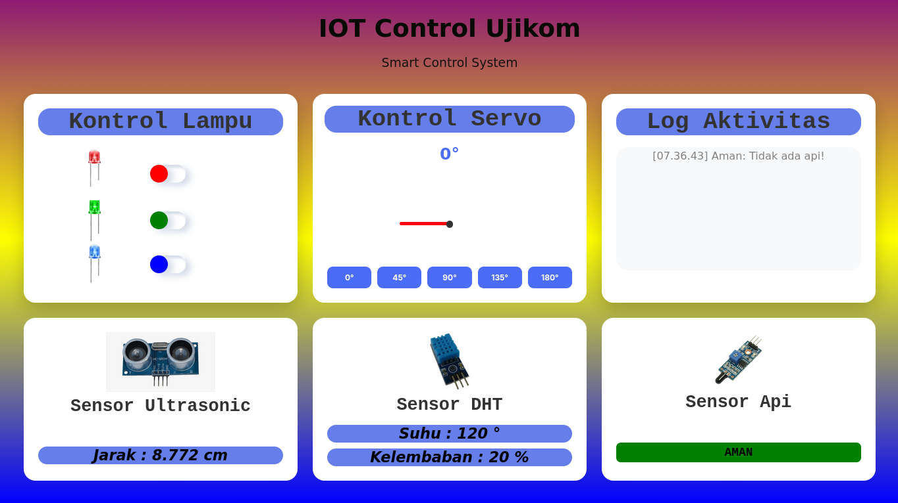
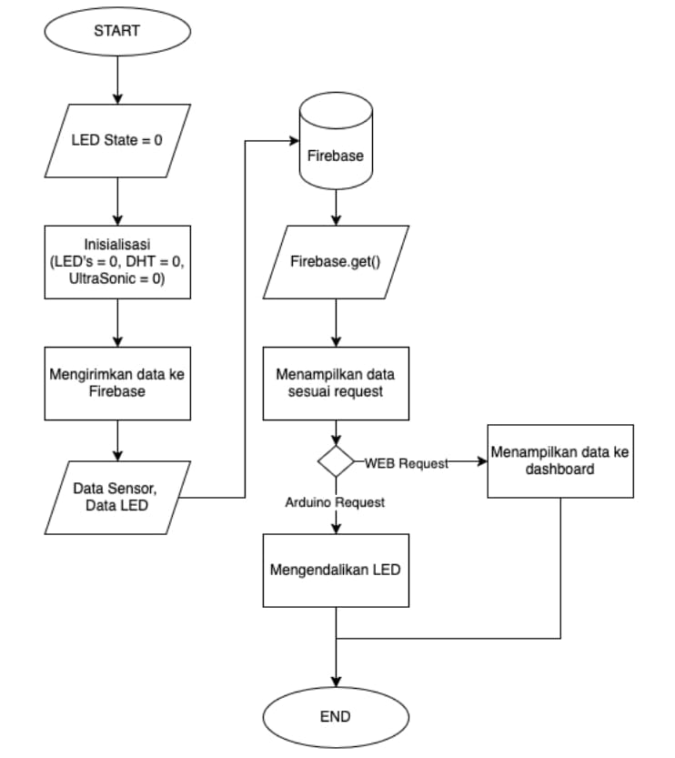

<!-- Warning :: Using CTRL + SHIFT + V For View README.md In Visual Studio Code :: Warning-->

<h1 align="center">IOT Dashboard Monitoring System</Strong></h1>
<h3 align="center">Created By : Rivaldi Fadlan XII-K1</h3>

 

 

 

<h2 align="center"><Strong> Tech-Stack : </Strong></h2>
<h3>Programming Language</h3>
<ul>
    <li>C++ (Arduino framework untuk ESP8266)</li>
    <li>Firebase (REALTIME DATABASE)</li>
    <li>HTML</li>
    <li>CSS</li>
    <li>Javascript</li>
</ul>

<h3>Hardware IOT</h3>
<ul>
    <li>ESP8266</li>
    <li>HC-SR04</li>
    <li>DHT11</li>
    <li>FLAME SENSOR</li>
    <li>LED</li>
    <li>SERVO MOTOR</li>
</ul>

<h3>HARDWARE PIN MAPPING</h3>

| Komponen     | Pin | GPIO   | Fungsi                 |
| ------------ | --- | ------ | ---------------------- |
| LED Merah    | D0  | GPIO5  | Output indikator       |
| LED Hijau    | D3  | GPIO4  | Output indikator       |
| LED Biru     | D4  | GPIO16 | Output indikator       |
| Flame Sensor | D1  | GPIO14 | Input deteksi api      |
| HC-SR04 TRIG | D6  | GPIO13 | Trigger ultrasonik     |
| HC-SR04 ECHO | D7  | GPIO12 | Echo ultrasonik        |
| DHT11        | D2  | GPIO2  | Data suhu & kelembaban |
| Servo Motor  | D5  | GPIO15 | PWM kontrol servo      |

**Catatan:**
- Semua komponen menggunakan **GND dan VCC** (Kecuali LED)

<h2 align="center"><Strong> Flowchart Schemas : </Strong></h2>

<h2 align="center"><Strong> How To Build :</Strong></h2>
<ol>
    <li>Persiapkan Hardware Yang Di Butuhkan</li>
    <li>Rakit IOT Hardware Sesuai Dengan Pin Mapping</li>
    <li>Hubungkan ESP8266 Dengan Komputer/Laptop</li>
    <li>Clone Git Repository (git clone https://github.com/fadlannn69/IOT-Dashboard-Monitoring-System.git)</li>
    <li>Install Arduino-IDE</li>
    <li>Tambahkan Source Json ESP8266 (http://arduino.esp8266.com/stable/package_esp8266com_index.json) di preferences</li>
    <li>Install Board ESP8266 Dari Boards Manager</li>
    <li>Buka Folder ESP Dari Folder Yang Tadi Sudah Di Clone</li>
    <li>Pilih Board & Port Yang sesuai</li>
    <li>Jalankan Code ESP</li>
</ol>

<h2 align="center"><Strong> How To Access Dashboard :</Strong></h2>
<ol>
    <li>Akses Browser e.g. librewolf , brave , atau firefox</li>
    <li>Akses Link (https://fadlannn69.github.io/IOT-Dashboard-Monitoring-System/index.html)</li>
    <li>Masukkan Kredensial Username & Password Di Login Page</li>
    <li>Masuk Ke Dashboard Page</li>
</ol>

## © 2026 Rivaldi Fadlan
All rights reserved. Unauthorized use, copying, modification, or distribution without permission is strictly prohibited.
